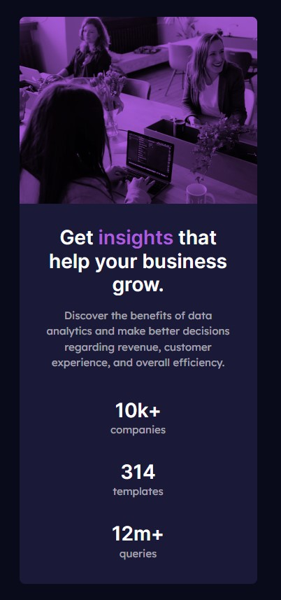

# Frontend Mentor - Stats preview card component solution

This is a solution to the [Stats preview card component challenge on Frontend Mentor](https://www.frontendmentor.io/challenges/stats-preview-card-component-8JqbgoU62). Frontend Mentor challenges help you improve your coding skills by building realistic projects.

## Table of contents

- [Overview](#overview)
  - [The challenge](#the-challenge)
  - [Screenshot](#screenshot)
  - [Links](#links)
- [My process](#my-process)
  - [Built with](#built-with)
  - [What I learned](#what-i-learned)
  - [Continued development](#continued-development)
- [Author](#author)

**Note: Delete this note and update the table of contents based on what sections you keep.**

## Overview

### The challenge

Users should be able to:

- View the optimal layout depending on their device's screen size

### Screenshot

### Links

- Solution URL: [Github](https://github.com/VimDiesel123/stats-preview-card-component-main)
- Live Site URL: [Netlify](https://iridescent-taffy-34a28e.netlify.app/)

## My process

### Built with

- Semantic HTML5 markup
- CSS custom properties
- Flexbox
- CSS Grid
- Mobile-first workflow
- [React](https://reactjs.org/) - JS library
- [Next.js](https://nextjs.org/) - React framework
- [Styled Components](https://styled-components.com/) - For styles

**Note: These are just examples. Delete this note and replace the list above with your own choices**

### What I learned

The trickiest part of this challenge for me was the image blended with the purple background. I ended up just using a div with the background property. I went with a blend-mode of multiply, but I'm not sure that was correct because the design looks a little different.

It wasn't so much the color of the image though that was tricky, but the size especially switching from mobile to desktop. For that I used flex-basis, but there's probably a better solution.

### Continued development

I need more practice working with images in resizable layouts.

I think I'm getting better at structuring my html and css to do more with less, although I should get more comfortable with BEM or some other system.

## Author

- Website - [David Smith](https://www.dsmithdev.com/)
- Frontend Mentor - [@VimDiesel123](https://www.frontendmentor.io/profile/VimDiesel123)
